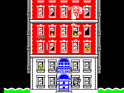
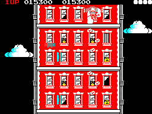
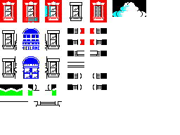
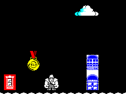
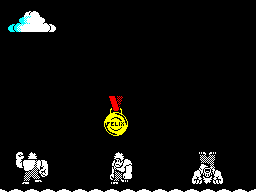

# Sprite and screen handling with zentools

This manual is focused on `zx scr`: converting, cropping, and combining ZX
Spectrum `.scr` screens, and managing sprite/tile collections cut from
them. It doesn't repeat the full flag reference — that's in the
[CLI manual](CLI.md) — but walks through the workflow with real artwork,
including one genuine, worth-knowing gotcha that a quick reference alone
wouldn't surface.

If you're looking for tape or snapshot handling, see the
[tape handling manual](TAPE-HANDLING.md) or the [CLI manual](CLI.md)
instead. This document is screens and sprites only.

## Contents

- [The tutorial assets](#the-tutorial-assets)
- [Building the asset library](#building-the-asset-library)
- [Compositing a scene with `zx scr paste`](#compositing-a-scene-with-zx-scr-paste)
- [Mono chunks, masks, and non-aligned positions](#mono-chunks-masks-and-non-aligned-positions)
- [Recognising on-screen text with `ocr`](#recognising-on-screen-text-with-ocr)
- [Reference notes](#reference-notes)

## The tutorial assets

The screenshots in this manual are real ZX Spectrum pixel art by
**Jarrod Bentley** — a set of Wreck-It-Ralph-themed character sprites,
tiles, and screens, published on [zxart.ee](https://zxart.ee) as a
"what would the home 8-bit conversion have looked like" exercise.
Genuine `.scr`-format artwork, not synthetic test data, which is
exactly the point: real pixel art has real inconsistencies a
hand-built fixture wouldn't, and doesn't always align to the round
numbers a tutorial might be tempted to assume.

Two kinds of source material, used differently below:

- **Complete screens** — a finished building facade, and an actual
  in-game screen (score, lives, clouds, the same building repeated) —
  shown here as *reference*: what a fully assembled result looks like,
  not something to cut apart.
- **Sheets** — a tile sheet (arcade booths, an ice-cream stand, clouds,
  ground) and two character sheets (animation frames, a medal, small
  portrait icons), laid out with visible gaps between each piece. These
  are what the tutorial actually cuts from.





*Two complete Jarrod Bentley screens, shown as reference for what a
finished tile-built scene looks like in practice.*

## Building the asset library



*The raw tile sheet these `--cells` coordinates come from.*

With boundaries confirmed precisely, `cut` is straightforward — the same
command as ever, now fed coordinates that are actually correct:

```
$ zx scr encode tiles_set.png -o tiles_set.scr
$ zx scr encode ralph_sprites.png -o ralph_sprites.scr
$ zx scr encode more_sprites.png -o more_sprites.scr

$ zx scr cut --cells 0,0,3,4    --name window_red    tiles_set.scr -o assets.cut
cut "window_red" (24x32, color) -> assets.cut [1 assets]
$ zx scr cut --cells 12,0,3,4   --name window_white  tiles_set.scr -o assets.cut
$ zx scr cut --cells 20,0,6,3   --name cloud          tiles_set.scr -o assets.cut
$ zx scr cut --cells 4,5,3,9    --name iceland         tiles_set.scr -o assets.cut
$ zx scr cut --cells 0,15,4,1   --name ground          tiles_set.scr -o assets.cut

$ zx scr cut --cells 0,0,4,4    --name ralph_stand    ralph_sprites.scr -o assets.cut
$ zx scr cut --cells 10,0,4,4   --name ralph_reach    ralph_sprites.scr -o assets.cut
$ zx scr cut --cells 0,10,4,4   --name ralph_roar     ralph_sprites.scr -o assets.cut
$ zx scr cut --cells 0,15,4,4   --name ralph_thump    ralph_sprites.scr -o assets.cut

$ zx scr cut --cells 16,0,3,5   --name felix_medal    more_sprites.scr -o assets.cut
$ zx scr cut --cells 20,12,8,2  --name portraits      more_sprites.scr -o assets.cut
```

`window_red` and `window_white` are the same size for a reason: both
are single-window units meant to be pasted repeatedly, side by side and
stacked, to build a building's face out of identical tiles — the same
construction Bentley's own reference screens use, not a single
building-sized chunk.

Eleven assets, each with the exact dimensions its `--cells` region
names:

```
$ zx scr ls assets.cut
#   NAME                 SIZE      PIXMAP
0   window_red           24x32     color
1   window_white         24x32     color
2   cloud                48x24     color
3   iceland              24x72     color
4   ground               32x8      color
5   ralph_stand          32x32     color
6   ralph_reach          32x32     color
7   ralph_roar           32x32     color
8   ralph_thump          32x32     color
9   felix_medal          24x40     color
10  portraits            64x16     color
```

```
$ zx scr atlas assets.cut --scale 3 -o atlas.png
wrote atlas.png (11 assets, 832x738)
```


*What `zx scr atlas` actually produces from `assets.cut` above — all
eleven pieces, at their real size, with their real names and dimensions.*

Worth a specific callout: `ground` is a genuine 32x8 — one cell tall,
thinner than "ground tile" might suggest. That's what the source art
actually has at that position, and the atlas confirms it renders as a
single thin strip, not a cropping mistake.

## Compositing a scene with `zx scr paste`

The natural next step is pasting these assets onto a screen to build a
scene — using `zx scr paste` itself, the same way a real game's own
sprite-drawing code would. Every asset above was cut without
`--bitmap-only`/`--mask`, so each one is a **colour** chunk: it carries
its own ink, paper, bright, and flash, not just a bitmap shape. Pasted
at a position where both `x` and `y` are multiples of 8 — a cell
boundary — `paste` writes that stored colour into the target screen's
attribute cells, not just the bitmap:

```
$ zx scr encode blank.png -o scene.scr
$ zx scr paste assets.cut:cloud       --at 152,8   --op or scene.scr -o scene.scr
$ zx scr paste assets.cut:ground      --at 0,184   --op or scene.scr -o scene.scr
$ zx scr paste assets.cut:ground      --at 32,184  --op or scene.scr -o scene.scr
$ zx scr paste assets.cut:ground      --at 64,184  --op or scene.scr -o scene.scr
$ zx scr paste assets.cut:ground      --at 96,184  --op or scene.scr -o scene.scr
$ zx scr paste assets.cut:ground      --at 128,184 --op or scene.scr -o scene.scr
$ zx scr paste assets.cut:ground      --at 160,184 --op or scene.scr -o scene.scr
$ zx scr paste assets.cut:ground      --at 192,184 --op or scene.scr -o scene.scr
$ zx scr paste assets.cut:ground      --at 224,184 --op or scene.scr -o scene.scr
$ zx scr paste assets.cut:window_red  --at 8,152   --op or scene.scr -o scene.scr
$ zx scr paste assets.cut:iceland     --at 176,112 --op or scene.scr -o scene.scr
$ zx scr paste assets.cut:ralph_roar  --at 88,152  --op or scene.scr -o scene.scr
$ zx scr paste assets.cut:felix_medal --at 56,104  --op or scene.scr -o scene.scr
$ zx scr decode scene.scr -o scene.png
```

Thirteen `paste` calls onto one blank canvas, nothing else involved —
and every piece comes out in its real colour: the red window tile, the blue
ICELAND stand with its lettering intact, the cyan-and-white cloud, the
green ground tiled along the bottom, the yellow-and-red FELIX medal.
Ralph himself renders in plain white on black, which is exactly how
the source art draws him — the checkered dither pattern Wreck-It-Ralph
sprites use is genuinely monochrome in the original, not a rendering
gap.



*The real result of the thirteen `paste` calls above — six colour
chunks, one canvas, every one in its own real colour.*

The same collection composes into an entirely different screen just by
choosing different assets and positions — nothing about `assets.cut`
changes between scenes, only the `paste` calls that read from it.

A second scene, reusing three of the Ralph frames cut earlier
(`ralph_stand`, `ralph_reach`, `ralph_thump`) side by side along the
ground, with the FELIX medal floating above the middle one:

```
$ zx scr encode blank.png -o scene2.scr
$ zx scr paste assets.cut:cloud        --at 8,8     --op or scene2.scr -o scene2.scr
$ zx scr paste assets.cut:ground       --at 0,184   --op or scene2.scr -o scene2.scr
$ zx scr paste assets.cut:ground       --at 32,184  --op or scene2.scr -o scene2.scr
$ zx scr paste assets.cut:ground       --at 64,184  --op or scene2.scr -o scene2.scr
$ zx scr paste assets.cut:ground       --at 96,184  --op or scene2.scr -o scene2.scr
$ zx scr paste assets.cut:ground       --at 128,184 --op or scene2.scr -o scene2.scr
$ zx scr paste assets.cut:ground       --at 160,184 --op or scene2.scr -o scene2.scr
$ zx scr paste assets.cut:ground       --at 192,184 --op or scene2.scr -o scene2.scr
$ zx scr paste assets.cut:ground       --at 224,184 --op or scene2.scr -o scene2.scr
$ zx scr paste assets.cut:ralph_stand  --at 16,152  --op or scene2.scr -o scene2.scr
$ zx scr paste assets.cut:ralph_reach  --at 104,152 --op or scene2.scr -o scene2.scr
$ zx scr paste assets.cut:ralph_thump  --at 192,152 --op or scene2.scr -o scene2.scr
$ zx scr paste assets.cut:felix_medal  --at 104,96  --op or scene2.scr -o scene2.scr
$ zx scr decode scene2.scr -o scene2.png
```



*Three of the four cut Ralph poses, one collection, a different
arrangement of `paste` calls.*

A third scene: two houses built the way Bentley's own reference screen
actually builds its building — repeating a single window tile across a
grid rather than placing one building-sized chunk. A bigger house,
three windows wide and three floors tall, and a smaller one beside it,
two windows wide and two floors tall — both with red windows on the
upper floors and white ones on the ground floor, both standing on the
same ground line, with a row of `portraits` out front like people in
the yard between them.

```
$ zx scr encode blank.png -o scene3.scr
$ zx scr paste assets.cut:cloud --at 8,8 --op or scene3.scr -o scene3.scr
$ zx scr paste assets.cut:ground --at 0,184   --op or scene3.scr -o scene3.scr
$ zx scr paste assets.cut:ground --at 32,184  --op or scene3.scr -o scene3.scr
$ zx scr paste assets.cut:ground --at 64,184  --op or scene3.scr -o scene3.scr
$ zx scr paste assets.cut:ground --at 96,184  --op or scene3.scr -o scene3.scr
$ zx scr paste assets.cut:ground --at 128,184 --op or scene3.scr -o scene3.scr
$ zx scr paste assets.cut:ground --at 160,184 --op or scene3.scr -o scene3.scr
$ zx scr paste assets.cut:ground --at 192,184 --op or scene3.scr -o scene3.scr
$ zx scr paste assets.cut:ground --at 224,184 --op or scene3.scr -o scene3.scr

# Big house: 3 windows wide, 2 red floors over 1 white ground floor.
$ zx scr paste assets.cut:window_red   --at 8,88   --op or scene3.scr -o scene3.scr
$ zx scr paste assets.cut:window_red   --at 8,120  --op or scene3.scr -o scene3.scr
$ zx scr paste assets.cut:window_white --at 8,152  --op or scene3.scr -o scene3.scr
$ zx scr paste assets.cut:window_red   --at 32,88  --op or scene3.scr -o scene3.scr
$ zx scr paste assets.cut:window_red   --at 32,120 --op or scene3.scr -o scene3.scr
$ zx scr paste assets.cut:window_white --at 32,152 --op or scene3.scr -o scene3.scr
$ zx scr paste assets.cut:window_red   --at 56,88  --op or scene3.scr -o scene3.scr
$ zx scr paste assets.cut:window_red   --at 56,120 --op or scene3.scr -o scene3.scr
$ zx scr paste assets.cut:window_white --at 56,152 --op or scene3.scr -o scene3.scr

# Small house: 2 windows wide, 1 red floor over 1 white ground floor.
$ zx scr paste assets.cut:window_red   --at 160,120 --op or scene3.scr -o scene3.scr
$ zx scr paste assets.cut:window_white --at 160,152 --op or scene3.scr -o scene3.scr
$ zx scr paste assets.cut:window_red   --at 184,120 --op or scene3.scr -o scene3.scr
$ zx scr paste assets.cut:window_white --at 184,152 --op or scene3.scr -o scene3.scr

$ zx scr paste assets.cut:portraits --at 88,168 --op or scene3.scr -o scene3.scr
$ zx scr decode scene3.scr -o scene3.png
```


*Twenty-two `paste` calls, but only two chunks doing all the work —
`window_red` and `window_white`, repeated in a grid at cell-aligned
positions, the same construction technique the original reference
screen uses.*

## Mono chunks, masks, and non-aligned positions

Two things change this picture, both worth knowing before they surprise
you mid-project.

**A mono chunk carries no colour of its own.** Cut with
`--bitmap-only` (or `--mask`, which implies it), an asset stores only
its bitmap shape — `zx scr ls` reports it as `mono` rather than
`color`. Pasting one doesn't touch the target's attributes at all,
cell-aligned or not: the shape blends into whatever colour is already
there.

```
$ zx scr cut --cells 0,10,4,4 --name ralph_mono --bitmap-only ralph_sprites.scr -o mono.cut
cut "ralph_mono" (32x32, mono) -> mono.cut [1 assets]
$ zx scr paste mono.cut:ralph_mono --at 32,80  --op or clash.scr -o clash.scr
$ zx scr paste mono.cut:ralph_mono --at 160,80 --op or clash.scr -o clash.scr
```

Pasted twice onto a screen with a red region on the left and a blue
one on the right, the identical mono cut comes out red on one side and
blue on the other — it has no attribute of its own to override
whatever the target cell already carries. This is real Spectrum
hardware behaviour, not a limitation: an 8x8 attribute cell has exactly
one ink colour and one paper colour, and a mono sprite drawn into it
takes on whichever colour is already assigned there, the same way a
monochrome sprite would on real hardware. It's also genuinely useful on
purpose — a silhouette that should always match its background, drawn
once and reused everywhere, is exactly what a mono chunk is for.

**A colour chunk pasted off the cell grid loses its colour too.** The
attribute write in `paste` is conditional on `x%8==0 && y%8==0`; at any
other position only the bitmap merges, silently, even for a `color`
chunk. Keeping every `--at` position a multiple of 8 — as every example
in this manual does — is what makes colour compositing work at all;
it's an easy position to get one pixel off by when a scene's layout
isn't itself built on an 8-pixel grid.

For a shape with a genuine transparent background rather than a solid
rectangular frame, the mask convention from the
[CLI manual](CLI.md#zx-scr) applies: paste a mask asset with `--op and`
first to clear the target region, then the real data with `--op or` —
composing a non-rectangular shape instead of a rectangular sprite
frame.

## Recognising on-screen text with `ocr`

`ocr` matches each 8x8 cell against the real Spectrum ROM font, so it
works well on genuine text and produces recognisable garbage on anything
else — both worth seeing, not just the success case.

A real BASIC output screen, captured from an actual emulator session
(the kind of fixture this project's own test suite uses):

```
$ zx scr ocr ocr-basic-output.scr
F=129 HL=4101


0 OK, 20:1
```

Real ROM-font characters, cleanly recognised, blank lines exactly where
the screen was actually blank.

Now the same command against a screen built from this tutorial's own
stylised pixel-art lettering (the "ICELAND" sign, hand-drawn to look
like signage, never rendered through the ROM font at all):

```
$ zx scr ocr tiles_set.scr
```

Garbage where the lettering sits, correctly so: `ocr` matches every cell
against the *nearest* ROM glyph regardless of whether the source was
ever meant to be text, exactly as documented — there's no separate
"this doesn't look like real text" detection, because reliably telling
stylised lettering from genuine ROM-font text from pixel content alone
isn't something this tool attempts. Getting a real answer out of `ocr`
means pointing it at an actual text screen, not signage that happens to
spell words.

## Reference notes

Everything in this manual is `zx scr`'s own subcommands — `encode`,
`decode`, `crop`, `cut`, `paste`, `ls`, `atlas`, `fromsnap`, `ocr` — with
full flag reference in the [CLI manual](CLI.md#zx-scr). Two things
worth restating here since they're easy to miss on a first read of that
reference alone:

- **`cut`/`paste` work in pixels or cells depending on the flag.**
  `--cells X,Y,W,H` (used throughout this manual) addresses whole 8x8
  Spectrum attribute cells; `--pixels X,Y,W,H` addresses raw pixel
  coordinates when a region doesn't align to the cell grid. `crop`
  additionally supports `--auto`, detecting a sprite's own bounding box
  automatically rather than specifying either by hand.
- **`paste` carries colour only for a `color` chunk at a cell-aligned
  position.** A chunk cut without `--bitmap-only`/`--mask` stores its
  own ink/paper/bright/flash; pasted at an `--at x,y` where both `x`
  and `y` are multiples of 8, that colour is written to the target.
  Anywhere else — a `mono` chunk, or any position off the cell grid —
  only the bitmap merges, and the target cell's own existing attribute
  is what the result shows up in.
